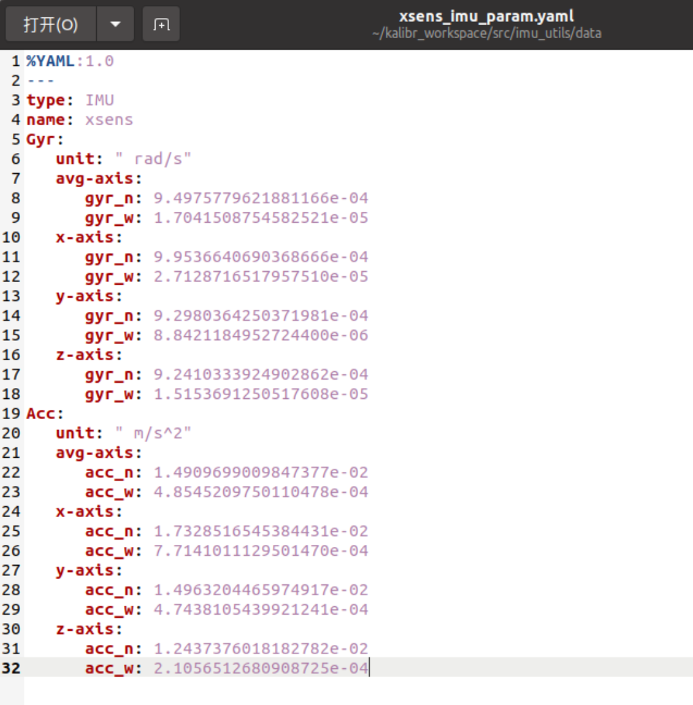
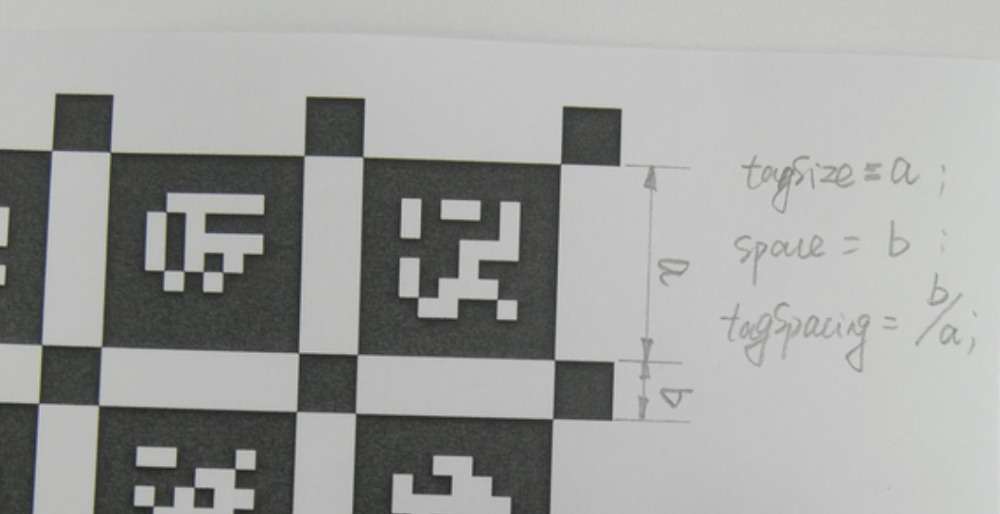

# 参数标定

使用kalibr离线标定法，安装imu_utils包和kalibr包以及标定过程可[参考网址](https://blog.csdn.net/weixin_67623597/article/details/138785149?spm=1001.2014.3001.5506)。在安装过程中可能出现报错问题，[可参考](https://blog.csdn.net/qq_39607707/article/details/125061020?spm=1001.2014.3001.5506)。

在Ubuntu20.04 ROS noetic上安装

## 一、IMU内参标定

安装使用imu_utils包进行IMU内参标定，可以校准IMU的噪声密度和随机游走噪声

前置依赖

- ceres
- sudo apt-get install libdw-dev

### 1 编译code_utils

```bash
cd kalibr_workspace/src
git clone https://github.com/gaowenliang/code_utils.git
cd ..
catkin_make
```

编译报错需要更改源码

1.1 CMakeLists.txt文件下

```cmake
set(CMAKE_CXX_FLAGS "-std=c++11") 改为 set(CMAKE_CXX_FLAGS "-std=c++14")
```

1.2 sumpixel_test.cpp

问题1：

```cpp
修改#include "backward.hpp"为 #include "code_utils/backward.hpp"
```

问题2：

添加头文件：

```cpp
#include"opencv2/imgcodecs/legacy/constants_c.h"
```

问题3：

opencv版本问题

```
CV_MINMAX 改为 NORM_MINMAX
```

1.3 mat_io_test.cpp文件下
由于代码为老的opencv，opencv4.x的有些宏改了名

```cpp
CV_LOAD_IMAGE_UNCHANGED 改为 cv::IMREAD_UNCHANGED
```

然后重新编译catkin_make即可


### 2 imu_utils编译

```bash
cd kalibr_workspace/src
git clone https://github.com/gaowenliang/imu_utils.git
cd ..
catkin_make
```

2.1 修改CMakeLists.txt

修改set(CMAKE_CXX_FLAGS "-std=c++11")为set(CMAKE_CXX_FLAGS "-std=c++14")

2.2 imu_an.cpp

添加头文件

```cpp
#include <fstream>
```

### 3 IMU数据采集

3.1 录制IMU数据包
无人机静置情况下采集飞控IMU数据，使用rosbag录制IMU静置数据，大约两小时

```bash
# 1、使用飞控IMU
##（确认飞控的串口连接正常，一般是 /dev/ttyACM0）
ls /dev/tty* 
##（为串口附加权限）
sudo chmod 777 /dev/ttyACM0
##（启动mavros）
roslaunch mavros px4.launch 
## 录制imu数据包
rosbag record /mavros/imu/data_raw -O imu_xsens.bag  
```

3.2 标定结果
2.2.1 配置launch文件
配置imu_utils/launch路径下的xsens.launch，相应名称和参数应以自己IMU为准

```xml
<node pkg="imu_utils" type="imu_an" name="imu_an" output="screen">
    <param name="imu_topic" type="string" value= "/mavros/imu/data_raw"/>	#话题名称
    <param name="imu_name" type="string" value= "xsens"/>	#标定结果名称
    <param name="data_save_path" type="string" value= "$(find imu_utils)/data/"/> #存放路径
    <param name="max_time_min" type="int" value= "120"/>  #加载多长时间的数据
    <param name="max_cluster" type="int" value= "400"/>	  #imu采样频率
</node>
```


2.2.2 运行 imu_utils 标定IMU

```bash
source devel/setup.bash
roslaunch imu_utils xsens.launch
rosbag play -r 200 imu_xsens.bag
```

在执行`roslaunch`命令后，会进入等待话题的状态：wait fot imu data，

然后再打开一个终端，尽快执行rosbag命令，程序进入bag读取，

当bag包加速回放完毕后，执行launch的窗口仍然会显示wait for imu data，等待一段时间计算，计算完毕后会显示计算结果，并保存。

可以在imu_utils/data路径下找到与imu_name对应的xxx_imu_param.yaml文件，其中_n代表noise，_w代表random walk。如下图所示，文件后续用到。



## 二、相机标定

### 1 内参标定环境

1.1 安装依赖

```bash
# 安装依赖项
sudo apt-get install python3-setuptools ipython3 libboost-all-dev doxygen libopencv-dev libeigen3-dev
sudo apt-get install libopencv-dev ros-noetic-vision-opencv ros-noetic-image-transport-plugins ros-noetic-cmake-modules python3-software-properties software-properties-common libpoco-dev python3-matplotlib python3-scipy python3-git python3-pip libtbb-dev libblas-dev liblapack-dev python3-catkin-tools libv4l-dev 
```

1.2 安装klibr功能包

```bash
cd ~/kalibr_workspace/src
git clone https://github.com/ethz-asl/Kalibr.git
cd ~/kalibr_workspace
catkin build -DCMAKE_BUILD_TYPE=Release -j4
```

如果导致catkin build有问题，**可以先把kalibr_workspace下的build和devel文件夹删掉**，再使用catkin build编译

遇到编译缺少依赖或其他原因报错，可自行安装或者根据报错问ai

### 2 制作标定板

下载[标定板](https://github.com/ethz-asl/kalibr/wiki/downloads)PDF以及yaml文件并制作

参数如下：



```yaml
target_type: 'aprilgrid' #gridtype
tagCols: 6               #number of apriltags
tagRows: 6               #number of apriltags
tagSize: 0.088           #size of apriltag, edge to edge [m]
tagSpacing: 0.3          #ratio of space between tags to tagSize
codeOffset: 0            #code offset for the first tag in the aprilboard
```

### 3 录制相机数据包

```bash
# 运行相机驱动
rqt_image_view   #查看图像
# 根据自己相机话题自行设置
rosrun topic_tools throttle messages /camera/infra1/image_rect_raw 4.0 /infra_left #左目设置为4hz
rosrun topic_tools throttle messages /camera/infra2/image_rect_raw 4.0 /infra_right #右目设置为4hz
rosbag record -O double_cam_1 /infra_left /infra_right #录左右目数据包
```

录制动作要缓慢，尽量使标定板能够到达相机边缘但是不要超出相机视野

### 4 标定

```bash
cd ~/kalibr_workspace
source devel/setup.bash
rosrun kalibr kalibr_calibrate_cameras --target /home/camera_data/april_6x6_80x80cm.yaml --bag /home/camera_data/double_cam_1.bag --models pinhole-radtan pinhole-radtan --topic /infra_left /infra_right --show-extraction --approx-sync 0.1 
```

命令解释：

--target后面是标定板参数文件的绝对路径

--bag后面是录制的数据包的绝对路径

--models后面是相机/畸变模型，有几目相机就要写几个，这里是两个针孔模型相机，所以是两个pinhole-radtan;相应地，其他支持的模型可以查看`Supported models · ethz-asl/kalibr Wiki · GitHub`

--topics后面是刚才录制的话题数据

--show-extraction是在标定过程中的一个显示界面，可以看到图片提取的过程，可以不要

--approx-sync 0.1　时间戳不对齐问题


## 三、相机imu联合标定

