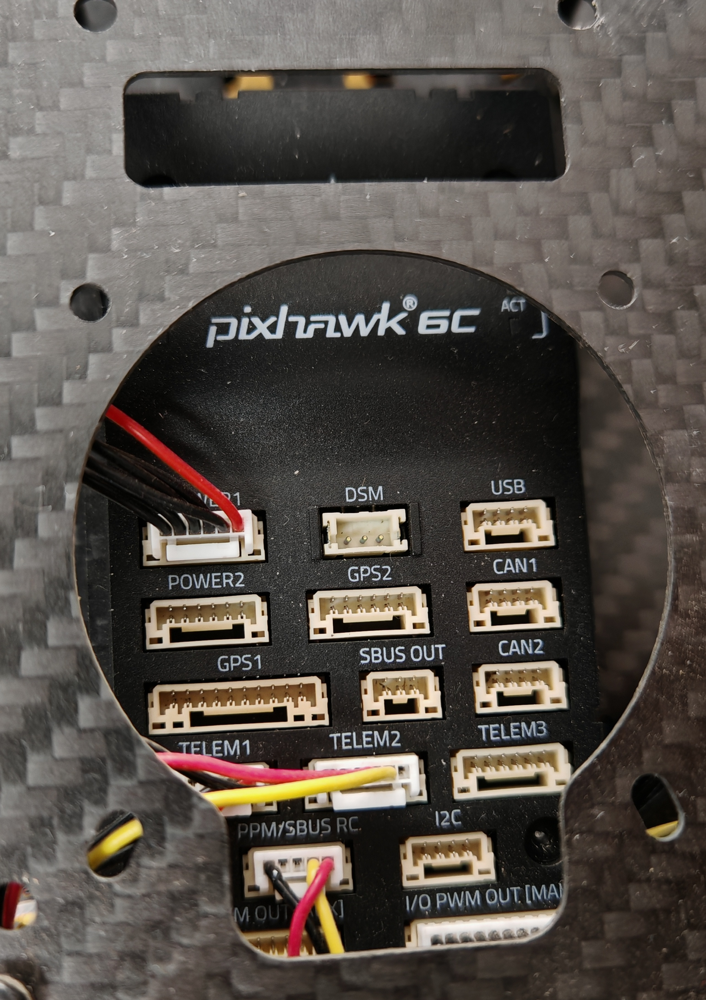

# My-Drone

项目旨在记录无人机从组装到自主飞行的实现

本项目应用fast-drone-250代码实现，无人机使用的相关配件见[无人机配件](./hardware_list.ods)。

机载点脑在`ubuntu20.04`环境下，ROS版本为`Noetic`

## 飞控安装和接线

- 项目使用的是阿木实验室的机架，不涉及电机焊接
- 飞控安装方向与机头方向一致
- 飞控连接电源线并且连接电机，
- TELEM1连接数传，TELEM2连接机载电脑，GPS2连接RTK模块
- 飞控引脚的详细说明可以参考px4官网

飞控的接线如下图所示

## 飞控设置

本项目最终为实现机载电脑控制自主飞行，官方PX4固件默认IMU频率为50Hz，需要自己修改源码编译固件，然后进行烧录，使其频率提升到200Hz，固件版本为1.14.3

- 机载点脑系统安装和飞控固件编译以及飞控与机载点脑通信可参考[jetson orin NX开发指南1-9](https://blog.csdn.net/qq_44998513/article/details/133754589)。

- 其他传感器与硬件连接与参数设置可以自行搜索

## Ego-Planner代码框架与参数介绍

* `src/planner/plan_manage/launch/single_run_in_exp.launch`下的：
  * `map_size`：当你的地图大小较大时需要修改，注意目标点不要超过map_size/2
  * `fx/fy/cx/cy`：修改为你的深度相机的实际内参（下一课有讲怎么看）
  * `max_vel/max_acc`：修改以调整最大速度、加速度。速度建议先用0.5试飞，最大不要超过2.5，加速度不要超过6
  * `flight_type`：1代表rviz选点模式，2代表waypoints跟踪模式
* `src/planner/plan_manage/launch/advanced_param_exp.xml`下的：
  * `resolution`：代表栅格地图格点的分辨率，单位为米。越小则地图越精细，但越占内存。最小不要低于0.1
  * `obstacles_inflation`：代表障碍物膨胀大小，单位为米。建议至少设置为飞机半径（包括螺旋桨、桨保）的1.5倍以上，但不要超过`resolution`的4倍。如果飞机轴距较大，请相应改大`resolution`
* `src/realflight_modules/px4ctrl/config/ctrl_param_fpv.yaml`下的：
  * `mass`：修改为无人机的实际重量
  * `hover_percent`：修改为无人机的悬停油门，可以通过px4log查看，具体可以参考[文档](https://www.bookstack.cn/read/px4-user-guide/zh-log-flight_review.md) 如果你的无人机是和课程的一模一样的话，这项保持为0.3即可。如果更改了动力配置，或重量发生变化，或轴距发生变化，都请调整此项，否则自动起飞时会发生无法起飞或者超调严重的情况。
  * `gain/Kp,Kv`：即PID中的PI项，一般不用太大改动。如果发生超调，请适当调小。如果无人机响应较慢，请适当调大。
  * `rc_reverse`：这项使用乐迪AT9S的不用管。如果在第十一课的自动起飞中，发现飞机的飞行方向与摇杆方向相反，说明需要修改此项，把相反的通道对应的值改为true。其中throttle如果反了，实际实验中会比较危险，建议在起飞前就确认好，步骤为：
    * `roslaunch mavros px4_THS0.launch`
    * `rostopic echo /mavros/rc/in`
    * 打开遥控器，把遥控器油门从最低满满打到最高
    * 看echo出来的消息里哪项在缓慢变化（这项就是油门通道值），并观察它是不是由小变大
    * 如果是由小变大，则不需要修改throttle的rc_reverse，反之改为true
    * 其他通道同理

## VINS的参数设置与外参标定

标定使用kalibr离线标定法，参考CSDN博主的推文进行标定[参数标定](https://blog.csdn.net/weixin_67623597/article/details/138785149?spm=1001.2014.3001.5506)。

相机内参

- 畸变参数
- 投影参数

外参：相机和IMU的位置关系

- 相机到IMU坐标系的旋转矩阵
- 相机到IMU坐标系的平移矩阵

参数设置

* 检查飞控mavros连接正常
  * `ls /dev/tty*`，确认飞控的串口连接正常。由于用机载电脑GPIO引脚连接飞控所以是`/dev/ttyTSH0`
  * `sudo chmod 777 /dev/ttyTSH0`，为串口附加权限
  * `roslaunch mavros px4_TSH0.launch`
  * `rostopic hz /mavros/imu/data_raw`，确认飞控传输的imu频率在200hz左右
* 检查realsense驱动正常
  * `roslaunch realsense2_camera rs_camera.launch`
  * 进入远程桌面，`rqt_image_view`
  * 查看`/camera/infra1/image_rect_raw`,`/camera/infra2/image_rect_raw`,`/camera/depth/image_rect_raw`话题正常
* VINS参数设置
  * 进入`realflight_modules/VINS_Fusion/config/`

  * 驱动realsense后，`rostopic echo /camera/infra1/camera_info`，把其中的K矩阵中的fx,fy,cx,cy填入`left.yaml`和`right.yaml`

  * 在home目录创建`vins_output`文件夹(如果你的用户名不是fast-drone，需要修改config内的vins_out_path为你实际创建的文件夹的绝对路径)

  * 修改`first_drone.yaml`的`body_T_cam0`和`body_T_cam1`的`data`矩阵的第四列为你的无人机上的相机相对于飞控的实际外参，单位为米，顺序为x/y/z，第四项是1，不用改

* VINS外参精确自标定
  * `sh shfiles/rspx4.sh`
  * `rostopic echo /vins_fusion/imu_propagate`
  * 拿起飞机沿着场地尽量缓慢地行走，场地内光照变化不要太大，灯光不要太暗，不要使用会频闪的光源，尽量多放些杂物来增加VINS用于匹配的特征点
  * 把`vins_output/extrinsic_parameter.txt`里的内容替换到`first_drone.yaml`的`body_T_cam0`和`body_T_cam1`
  * 重复上述操作直到走几圈后VINS的里程计数据偏差收敛到满意值（一般在0.3米内）
* 建图模块验证
  * `sh shfiles/rspx4.sh`
  * `roslaunch ego_planner single_run_in_exp.launch`
  * 进入远程桌面 `roslaunch ego_planner rviz_exp.launch`

## Ego-Planner的实验

遥控器通道设置

- 五通道设置三种飞行模式
  - 自稳模式
  - 位置模式(offboard)
  - offboard
- 六通道为轨迹跟随模式

* 自动起飞：

  * `sh shfiles/rspx4.sh`
  * `rostopic echo /vins_fusion/imu_propagate`
  * 拿起飞机进行缓慢的小范围晃动，放回原地后确认没有太大误差
  * 遥控器5通道拨到内侧，六通道拨到下侧，油门打到中位
  * `roslaunch px4ctrl run_ctrl.launch`
  * `sh shfiles/takeoff.sh`，如果飞机螺旋桨开始旋转，但无法起飞，说明`hover_percent`参数过小；如果飞机有明显飞过1米高，再下降的样子，说明`hover_percent`参数过大
  * 遥控器此时可以以类似大疆飞机的操作逻辑对无人机进行位置控制
  * 降落时把油门打到最低，等无人机降到地上后，把5通道拨到中间，左手杆打到左下角上锁
* Ego-Planner实验
  * 自动起飞
  * `roslaunch ego_planner single_run_in_exp.launch`
  * `sh shfiles/record.sh`
  * 进入远程桌面 `roslaunch ego_planner rviz.launch`
  * 按下G键加鼠标左键点选目标点使无人机飞行
* 如果实验中遇到意外怎么办！！！
  * `case 1`: VINS定位没有飘，但是规划不及时/建图不准确导致无人机规划出一条可能撞进障碍物的轨迹。如果飞手在飞机飞行过程中发现无人机可能会撞到障碍物，在撞上前把6通道拨回上侧，此时无人机会退出轨迹跟随模式，进入VINS悬停模式，在此时把无人机安全着陆即可
  * `case 2`：VINS定位飘了，表现为飞机大幅度颤抖/明显没有沿着正常轨迹走/快速上升/快速下降等等，此时拨6通道已经无济于事，必须把5通道拨回中位，使无人机完全退出程序控制，回到遥控器的stablized模式来操控降落
  * `case 3`：无人机已经撞到障碍物，并且还没掉到地上。此时先拨6通道，看看飞机能不能稳住，稳不住就拨5通道手动降落
  * `case 4`：无人机撞到障碍物并且炸到地上了：拨5通道立刻上锁，减少财产损失
  * `case 5`：**绝招** 反应不过来哪种case，或者飞机冲着非常危险的区域飞了，直接拨7通道紧急停桨。这样飞机会直接失去动力摔下来，对飞机机身破坏比较大，一般慢速情况下不建议。